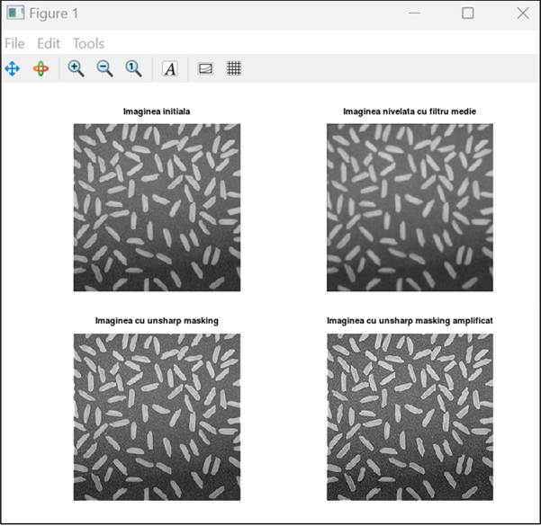
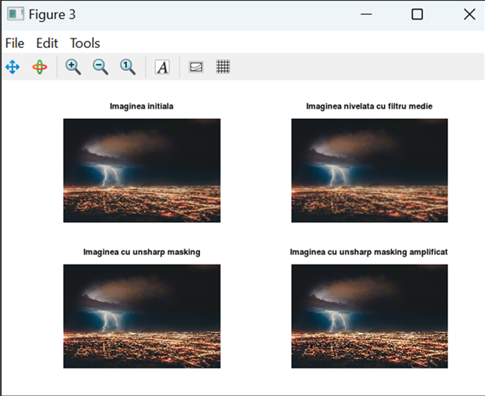

# Unsharp Masking

A project implementing the Unsharp Masking technique for image enhancement in MATLAB/Octave. This method improves image clarity by emphasizing edges and fine details.

## Features

- **Enhancement of grayscale and color images** using the Unsharp Masking technique.
- **Customizable sharpening strength** to control the level of enhancement.
- **MATLAB/Octave implementation** with optimized filtering methods.

## Getting Started

Follow these steps to set up and run the project on your local machine.

### Prerequisites

- MATLAB or GNU Octave (recommended for compatibility).

### Installation

Clone the repository using:

```bash
git clone https://github.com/galbinasuana/Unsharp-Masking.git
```

## Usage

### Sharpening a Grayscale or Color Image

1. Open `unsharp_masking.m` in MATLAB/Octave.
2. Select an input image (e.g., `rice.png`, `vulcano.png`, `lightning.png`).
3. Run the script to apply the unsharp masking technique.
4. The script will display the original image, the blurred version, and the enhanced versions with different sharpening strengths.
5. The processed images will be saved automatically.

## Understanding the Code

### Unsharp Masking Algorithm

- The script reads an input image and converts it into a numerical matrix.
- A smoothing filter (from `masca.txt`) is applied to generate a blurred version of the image.
- The difference between the original and the blurred image is computed.
- The result is amplified based on a user-defined factor to enhance edges.
- The final sharpened image is reconstructed.

## Example Results

### Rice Image Enhancement

**Original vs. Processed Rice Image** 


### Volcano Image Enhancement

**Original vs. Processed Volcano Image**  


### Lightning Image Enhancement

**Original vs. Processed Lightning Image**  
